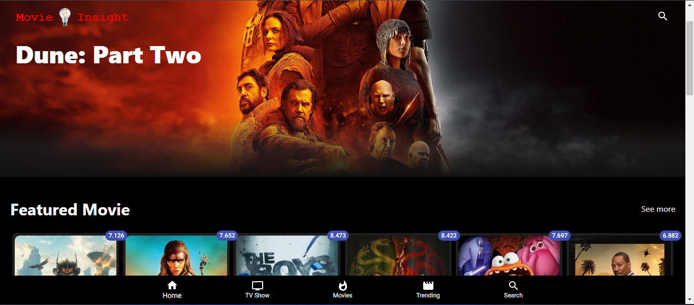

# Movie insight

<table>
<tr>
<td>
  Movie Insight gives you every information you need to know about a movie built in React JS and Material UI.
</td>
</tr>
</table>

## Demo

https://movieinsight.vercel.app/

## Available Scripts

In the project directory, you can run:

### `yarn install`

### `yarn start`

Runs the app in the development mode.\
Open [http://localhost:3000](http://localhost:3000) to view it in your browser.

## Authors

- [@Aderibigbe Festus](https://github.com/Festus891)

## Deployment

This project is deployed directing on [Vercel](https://vercel.com/login?next=%2Fdashboard)

## Features

- TMDB Api integration on this project [TMDB API](https://developer.themoviedb.org/docs/getting-started)
- Material Ui Library is use for pages responsiveness and icon

## Tech Stack

**Stacks:** React, CSS, Material Ui, Tmdb Api's
